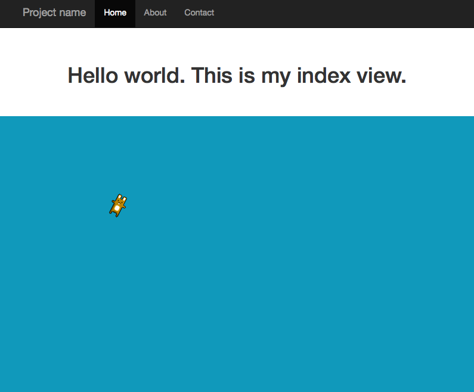

## Pixi in Django
### Demo of a Pixijs example inside Django framework with Twitter Bootstrap starter-template

Setup as directed in git repo NTBlok/newProject_setupNotes:

    git clone https://github.com/NTBlok/newProject_setupNotes.git

